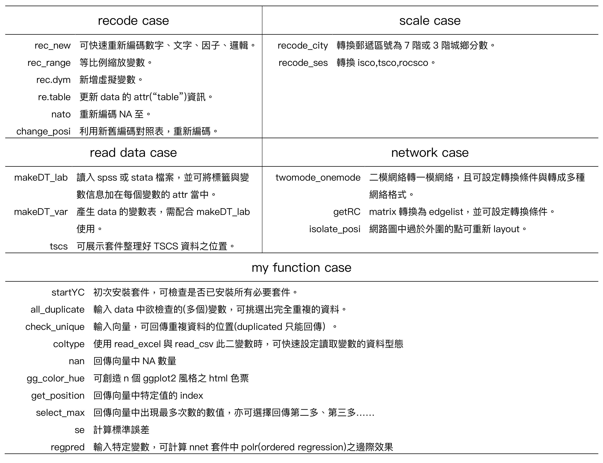

```{r setup, include=FALSE}
knitr::opts_chunk$set(echo = TRUE)
#knitr::opts_knit$set(max.print = 50)
options(max.print = 50)

library(YCfun)
```

## Download and start
```{r ,eval=F}
#Download from github
library(devtools)
install_github("chang70480/YCfun")
#wait fot installing

library(YCfun)

#check other packages have been installed.
YCstart()
```

  
## Cheat sheet
```{r pressure, echo=FALSE,out.width='100%'}


```
  
  
##Read data
```{r,warning=FALSE,message=F}
DT <- makeDT_lab(path = system.file("extdata/tscs151.sav",package = "YCfun"))
## re-encoding from CP950  
  
DT$v6a
```
  
  
##Variables table
```{r}
DT_var <- makeDT_var(DT)
DT_var[20:30,]
```
  
  
## Recoding
This function is based on sjmisc package.  
rec_new can recode in four datatypes, including numeric, factor, character, logical.
  
### numeric to numeric
```{r}

rec_new(DT$v6a,"1,2=1;3=2;4,5=3;6,7,8,9=4;10:15=5;16:19=6;20=7;21=8;97=NA;else=copy")
```
  
### numeric to factor, and can set reference group=4
```{r}
rec_new(DT$v6a,"1,2=1;3=2;4,5=3;6,7,8,9=4;10:15=5;16:19=6;20=7;21=8;else=NA",'f',ref = 4)
```
```{r}
rec_new(DT$v6a,"1,2=no;3:5=low;6,7,8,9=mid;10:21=high;else=NA",'f',ref = "mid")
```
### numeric to character
```{r}
DT$neweduc <- rec_new(DT$v6a,"1,2=no;3:5=low;6,7,8,9=mid;10:21=high;else=NA",'c')
DT$neweduc
```

### character to numeric
```{r}
DT$newedun <- rec_new(DT$neweduc,"no=1;low=2;mid=3;high=4")
DT$newedun
```
