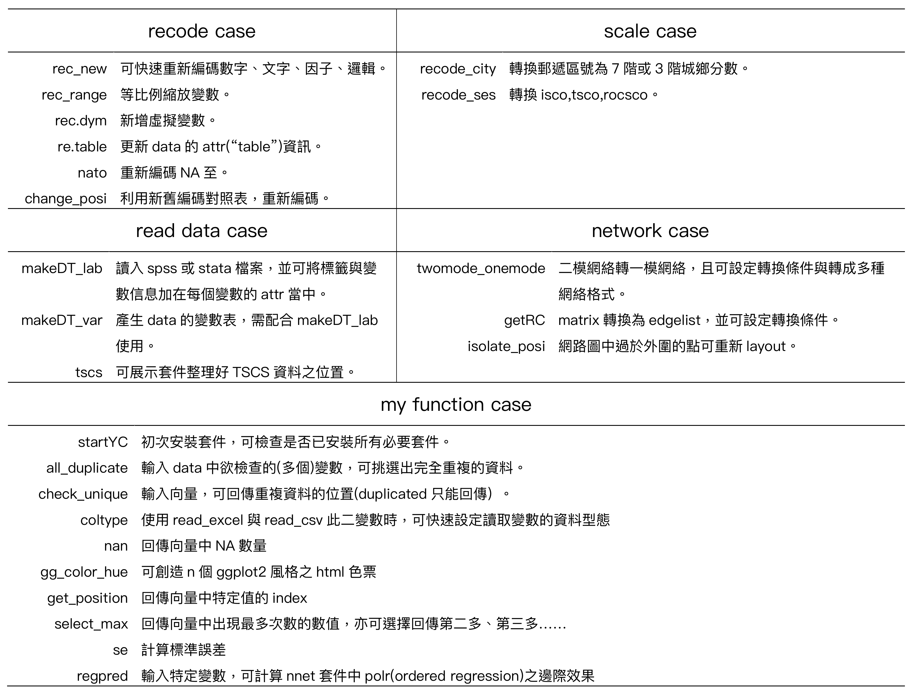

Download and start
------------------

``` r
#Download from github
library(devtools)
install_github("chang70480/YCfun")
#wait fot installing

library(YCfun)

#check other packages have been installed.
YCstart()
```

Cheat sheet
-----------



Read data
---------

``` r
DT <- makeDT_lab(dir = system.file("extdata/tscs151.sav",package = "YCfun"))
```

    ## Warning in read.spss(file = dir, use.value.labels = F, to.data.frame =
    ## T): /Library/Frameworks/R.framework/Versions/3.5/Resources/library/YCfun/
    ## extdata/tscs151.sav: Long string value labels record found (record type 7,
    ## subtype 21), but ignored

    ## re-encoding from CP950

``` r
DT$v6a
```

    ##   [1]  8 19 20  8  8 19  4  4 19  8 11  4  8 19  4  6  6 10  6  8 20  3  4
    ##  [24] 20  8  4 20 20 11 10 20 19 11 18 19 19  8 20 19 19  3 19  8 19  4 19
    ##  [47]  8 12 11  3 19  1 19  4  4 17 19 10  4  2  3 11 21 19 10 18 19 19 19
    ##  [70] 19 19  8 20 20 20 19 20 12 20 19 10 11 19 19 20  8 20 18  8 19 11  6
    ##  [93]  8 19 19 19 19 19  6 19
    ##  [ reached getOption("max.print") -- omitted 1934 entries ]
    ## attr(,"value.labels")
    ##                  遺漏值                    拒答                  不知道 
    ##                    "99"                    "98"                    "97" 
    ##                    跳答                    其他           博士(續答6a2) 
    ##                    "96"                    "22"                    "21" 
    ##           碩士(續答6a2)           大學(續答6a2) 技術學院、科大(續答6a2) 
    ##                    "20"                    "19"                    "18" 
    ##         軍警官學校/大學                空中大學            空中行(商)專 
    ##                    "17"                    "16"                    "15" 
    ##              軍警專科班              軍警專修班                    三專 
    ##                    "14"                    "13"                    "12" 
    ##                    二專                    五專                士官學校 
    ##                    "11"                    "10"                     "9" 
    ##           高職(續答6a1)       綜合高中(續答6a1)           高中(續答6a1) 
    ##                     "8"                     "7"                     "6" 
    ##                    初職                國(初)中                    小學 
    ##                     "5"                     "4"                     "3" 
    ## 自修(識字、私塾)(跳答7)       無(不識字)(跳答7) 
    ##                     "2"                     "1" 
    ## attr(,"variable.labels")
    ## [1] "6a.請問您的教育程度是?"
    ## attr(,"table")
    ## 
    ##    1    2    3    4    5    6    7    8    9   10   11   12   13   14   15 
    ##   95   16  289  251    6   86   16  428    4   57  130   18    3    8    4 
    ##   16   17   18   19   20   21   22   97 <NA> 
    ##    5    7  207  271  111   17    3    2    0

Variable table
--------------

``` r
DT_var <- makeDT_var(DT)
DT_var[20:30,]
```

    ## # A tibble: 11 x 2
    ##    題號    內容                                             
    ##    <chr>   <chr>                                            
    ##  1 v1      1.性別                                           
    ##  2 v2y     2.請問您是什麼時候出生的(以身分證上的為主)?民國年
    ##  3 v2m     2.請問您是什麼時候出生的(以身分證上的為主)?月    
    ##  4 v2a     2.請問您大約幾歲?                                
    ##  5 v3city  3.請問您出生在什麼地方?省/縣/市                  
    ##  6 kv3city 3.請問您出生在什麼地方?其他                      
    ##  7 v3zip   3.請問您出生在什麼地方?鄉/鎮/市/區               
    ##  8 v4      4.請問您父親是哪裡人?                            
    ##  9 kv4     4.請問您父親是哪裡人?其他                        
    ## 10 v5      5.請問您母親是哪裡人?                            
    ## 11 kv5     5.請問您母親是哪裡人?其他
